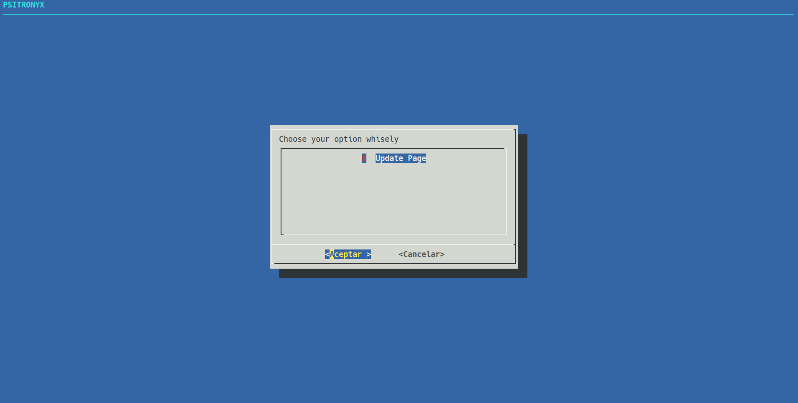

# PSITRONYX



## DESCRIPTION

PSITRONYX is a simple C&C ( Command and Control ) tool made in Python and UI made by dialog. It has a Keep Alive module that opens a port for listening clients, the Visualization and Connection module that shows the active Clients and lets you decide which to connect and the Web Page module to download the pyw file. 

## Requirements

```cmd
$ sudo apt install python3-dialog
$ pip3 install flask
$ pip3 install logging
```

## Ussage

```cmd
$ python3 main.py
```
- Modify the IP´s according your setup.
- Press the first row to update the page.
- The file ./bin/ckacnm.py is the client´s file.
