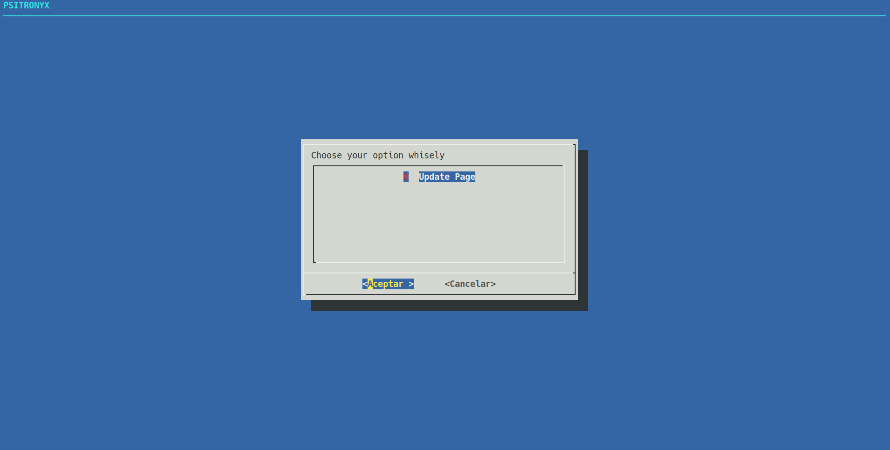
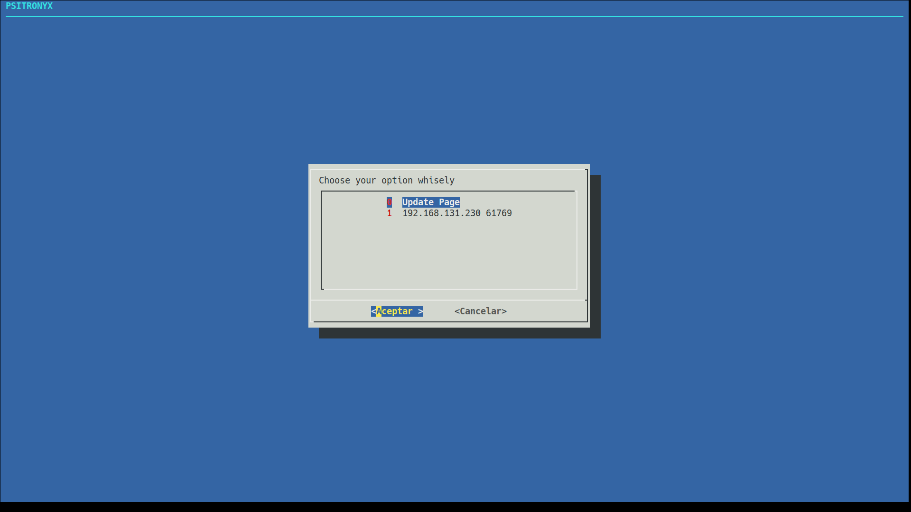

# PSITRONYX DOCUMENTATION



## 1. Downloading and Dependences
```shell
$ git clone https://github.com/d1hn1/psitronyx
$ cd psitronyx

$ sudo apt install python3-dialog
$ pip3 install flask
$ pip3 install logging
```
> Start by clonning the repo into your local machine, then cd into it. Then you will have to install some things like python3-dialog and some pip3 libraries like flask and logging that´s already in the sistem but just in case.

## 2. Ussage
```shell
$ python3 main.py
```
> To start PSITRONYX you just have to python3 main.py, so do it. You will have in front a dialog style UI waiting for connections. In the background there´s a port receiving Keep Alive requests and another for a web to download the ../bin/ckacnm.pyw file.

## 3. Configuring
```python3
#!/usr/bin/python3

import os
import time
import socket
import threading

CLIENT_IP = '0.0.0.0' #
CLIENT_PORT = 10011 #

SERVER_KA_IP 	= '127.0.0.1' #
SERVER_KA_PORT	= 10010 #
```
> Here is a portion of the ckacnm.pyw file, you will have to change (or not) the variables marked with # according to your configuration.
```python3
#/usr/bin/pythnon3

import sys
sys.path.insert(0, "./src/code/")
sys.path.insert(0, "./src/www/")

from www import serverWebPageThreaded
from kam import listenForKeepAliveThreaded
from vscnm import hostDialogVisualization

HOST_IP = '0.0.0.0' #

WEB_PORT = 8080 #
KEEP_ALIVE_PORT = 10010 #
CLIENT_CONNECTION_PORT = 10011 #

DIALOG_BIN_PATH = "/usr/bin/dialog" #
DEVICES_CONNECTED = [("0","Update Page")]
```
> Here is a portion of the main.py file, you will have to change (or not) the variables marked with # according to your configuration.

## 4. Selecting which to connect

> Once you have installed correctly the pyw file into a computer it will appear in PSITRONYX pressing in Update Page.
> Then you just have to move and enter into it. It will appear a shell which you can input commands in.
